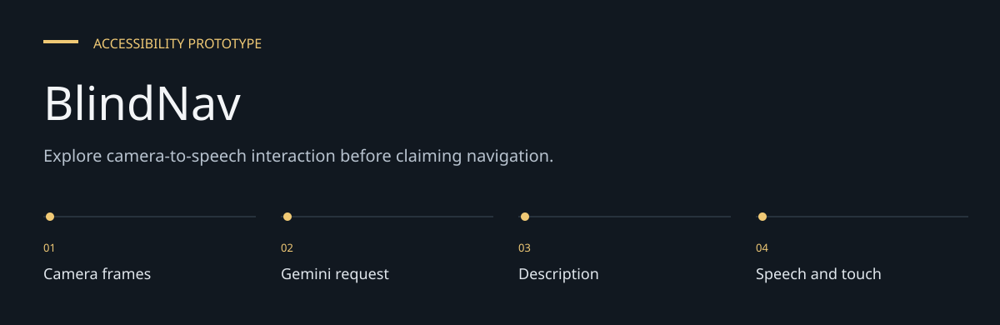
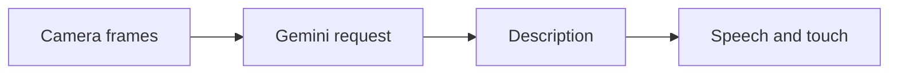

# BlindNav

**Explore camera-to-speech interaction before claiming navigation.**

An Expo / React Native prototype that captures camera images and generates spoken scene
information through Google Gemini. Speech and haptic services support the camera interface.
The current app routes to `CameraScreenLive`, despite also retaining an older camera screen.


[Architecture](docs/ARCHITECTURE.md) · [Evaluation guide](docs/EVALUATION.md)

**Contents:** [The challenge](#the-challenge) · [Walkthrough](#walk-through-the-project) ·
[Implementation](#implementation-state) · [Design choices](#engineering-choices) ·
[Next evidence](#next-evidence-to-collect)

---

## The challenge

Camera-based descriptions may help a blind user ask what is around them, but model output, speech
pacing and interaction controls must work together. This prototype investigates that interface;
reliable mobility and obstacle avoidance require separate validation.

## System at a glance



## Walk through the project

### 1. Start from home

Use the large start control. The root app changes its screen state and initializes speech
preferences.

### 2. Grant permissions

Evaluate camera and media behavior on a suitable device. Permission refusal should be part of the
review, not skipped as a setup nuisance.

### 3. Listen to descriptions

The active CameraScreenLive calls the generation session and presents speech. Inspect response
delay and failures without treating a generated scene as verified ground truth.

### 4. Exit and inspect services

Leave the camera and examine speech/haptic cleanup. Compare the active screen with the retained
older camera implementation to avoid evaluating the wrong code path.

## Implemented pieces

- A large start control and a camera screen.
- Camera-frame analysis, generated descriptions and native speech output.
- Haptic patterns and speech-service controls.
- Zustand state for screen and user preferences.
- Committed iOS native project and a speech-service unit test file.

## Local setup

```bash
git clone https://github.com/DanushArun/BlindNav.git
cd BlindNav
npm ci
cp .env.example .env
npm start
```

Set `EXPO_PUBLIC_GEMINI_API_KEY` to your own development key.
The active service names `gemini-2.0-flash-exp`; current provider availability was not verified.
Camera evaluation requires a device or suitable emulator and camera/microphone permissions.

Native development commands declared in the manifest:

```bash
npm run ios
npm run android
```

These compile native applications and require the corresponding Xcode or Android toolchain.
Expo public environment variables are embedded in the client bundle; they are not a secure
server-side secret store. See [Expo environment
guidance](https://docs.expo.dev/guides/environment-variables/).

## Source map

- [App.tsx](App.tsx): home/camera routing and speech initialization.
- [CameraScreenLive.tsx](src/screens/CameraScreenLive.tsx): active camera experience.
- [geminiLive.ts](src/services/ai/geminiLive.ts): current generation session.
- [speechService.ts](src/services/speech/speechService.ts): speech handling.
- [hapticsService.ts](src/services/haptics/hapticsService.ts): haptic patterns.

## Verification and boundaries

The README was checked against source, scripts and Expo SDK 54 documentation.
No device trial, accessibility audit or live provider evaluation was performed.
There is a unit-test source file, but `package.json` has no `test` script.

Network-based scene understanding is not an independently validated offline navigation system.
The repository does not demonstrate reliable obstacle detection, route guidance or safe navigation
with blind users. Generated descriptions may be wrong or delayed; evaluate the prototype with
supervision and established mobility aids before any real-world reliance.

## Engineering choices

**Active screen is explicit.** App.tsx routes to CameraScreenLive, so that path governs current
behavior.

**Feedback is separate from inference.** Speech/haptic services translate output into interaction,
but cannot certify the observation.

**Public key variable.** EXPO_PUBLIC configuration reaches the application bundle; it is not a
protected backend secret.

## Implementation state

| State | Current evidence |
| --- | --- |
| Present | Home/camera flow, generation and feedback source |
| Present | iOS project and speech unit-test source |
| Not verified | Current model access and device behavior |
| Not demonstrated | Offline perception or safe autonomous navigation |

The [architecture guide](docs/ARCHITECTURE.md) maps these statements to source entry points.
The [evaluation guide](docs/EVALUATION.md) separates inspection, executable checks and
domain validation, with the next evidence needed for each project.

## Next evidence to collect

- Run supervised device and screen-reader evaluations.
- Measure response latency and error/unknown states.
- Design a secure provider boundary before distributing builds.
