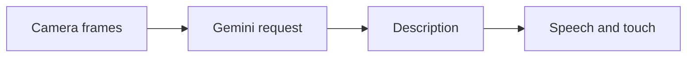

# BlindNav — Architecture and implementation

This guide follows the tracked implementation. Proposed work is identified separately.

## The problem and the system boundary

Camera-based descriptions may help a blind user ask what is around them, but model output, speech
pacing and interaction controls must work together. This prototype investigates that interface;
reliable mobility and obstacle avoidance require separate validation.

## Processing path

## End-to-end behavior

### 1. Start from home

Use the large start control. The root app changes its screen state and initializes speech
preferences.

### 2. Grant permissions

Evaluate camera and media behavior on a suitable device. Permission refusal should be part of the
review, not skipped as a setup nuisance.

### 3. Listen to descriptions

The active CameraScreenLive calls the generation session and presents speech. Inspect response
delay and failures without treating a generated scene as verified ground truth.

### 4. Exit and inspect services

Leave the camera and examine speech/haptic cleanup. Compare the active screen with the retained
older camera implementation to avoid evaluating the wrong code path.

## Design choices and consequences

### Active screen is explicit

App.tsx routes to CameraScreenLive, so that path governs current behavior.

### Feedback is separate from inference

Speech/haptic services translate output into interaction, but cannot certify the observation.

### Public key variable

EXPO_PUBLIC configuration reaches the application bundle; it is not a protected backend secret.

## Source entry points

### [App.tsx](../App.tsx)

This file is part of the reviewed path described above. Follow its imports and calls
for the exact interface rather than inferring behavior from the filename.

### [src/screens/HomeScreen.tsx](../src/screens/HomeScreen.tsx)

This file is part of the reviewed path described above. Follow its imports and calls
for the exact interface rather than inferring behavior from the filename.

### [src/screens/CameraScreenLive.tsx](../src/screens/CameraScreenLive.tsx)

This file is part of the reviewed path described above. Follow its imports and calls
for the exact interface rather than inferring behavior from the filename.

### [src/services/ai/geminiLive.ts](../src/services/ai/geminiLive.ts)

This file is part of the reviewed path described above. Follow its imports and calls
for the exact interface rather than inferring behavior from the filename.

### [src/services/speech/speechService.ts](../src/services/speech/speechService.ts)

This file is part of the reviewed path described above. Follow its imports and calls
for the exact interface rather than inferring behavior from the filename.

## Implementation state

| State | Evidence boundary |
| --- | --- |
| Present | Home/camera flow, generation and feedback source |
| Present | iOS project and speech unit-test source |
| Not verified | Current model access and device behavior |
| Not demonstrated | Offline perception or safe autonomous navigation |

“Present” means tracked source or assets exist. It does not mean a production or domain
validation has passed. See [Evaluation](EVALUATION.md) for reproducible checks and limits.
